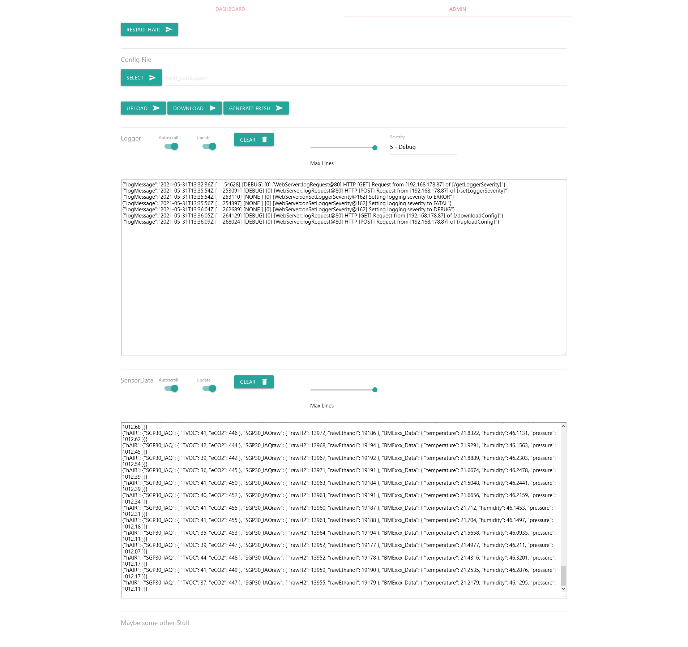

# hAIR
HSB Air Station

# Hardware / Board

TTGO T-Display ESP32

- https://www.amazon.de/-/en/T-Display-Bluetooth-Module-Development-Arduino/dp/B07WTNCWLW
- https://eckstein-shop.de/LILYGOZ-TTGO-T-Display-ESP32-WiFi-and-Bluetooth-Module-Development-Board-114-Inch-LCD-Control-Board
- Setup: https://www.youtube.com/watch?v=u7277VShso4

Adafruit SGP30

- https://www.adafruit.com/product/3709

BMExxx (to decide)

- https://www.bosch-sensortec.com/products/environmental-sensors/gas-sensors/bme680/
- https://www.bosch-sensortec.com/products/environmental-sensors/gas-sensors/bme688/
- https://www.bosch-sensortec.com/products/environmental-sensors/humidity-sensors-bme280/

# IDE

Visual Studio Code

Extensions

- Platform IO, https://marketplace.visualstudio.com/items?itemName=platformio.platformio-ide
- C/C++, https://marketplace.visualstudio.com/items?itemName=ms-vscode.cpptools
- C++ Intellisense, https://marketplace.visualstudio.com/items?itemName=austin.code-gnu-global
- Clang-Tidy, https://marketplace.visualstudio.com/items?itemName=notskm.clang-tidy
- Clang-Tidy GUI, https://marketplace.visualstudio.com/items?itemName=TimZoet.clangtidygui
- Clang-Format, https://marketplace.visualstudio.com/items?itemName=xaver.clang-format
- Duplicate selection or line, https://marketplace.visualstudio.com/items?itemName=geeebe.duplicate
- GitLens, https://marketplace.visualstudio.com/items?itemName=eamodio.gitlens

# clang-tidy checks
    "clang-tidy.checks": [
        "clang-diagnostic-",
        "-android-",
        "-boost-",
        "bugprone-",
        "cert-",
        "cppcoreguidelines-",
        "-cppcoreguidelines-pro-bounds-array-to-pointer-decay",
        "clang-analyzer-",
        "-fuchsia-",
        "-google-",
        "-hicpp-",
        "llvm-",
        "-llvm-include-order",
        "misc-",
        "modernize-",
        "-modernize-use-trailing-return-type",
        "-modernize-concat-nested-namespaces",
        "-mpi-",
        "-objc-",
        "performance-",
        "readability-*",
        "-readability-magic-numbers"
    ]

# First Impressions

